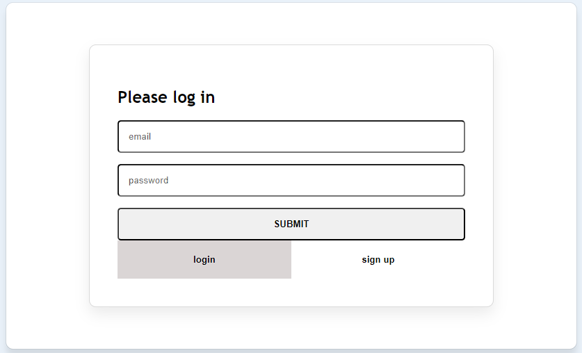

# CRUD  de Notas 

Este es un proyecto CRUD (Crear, Leer, Actualizar, Eliminar) de notas, donde las notas están asociadas a un usuario único. Los usuarios pueden crear una cuenta e iniciar sesión, y todas las peticiones se hacen con la autorización por cabecera de JSON Web Token (JWT)

## Tecnologías utilizadas

Este proyecto fue creado con el stack PERN (PostgreSQL, Express, React y Node.js). Las dependencias de producción del backend incluyen bcrypt, dotenv, express, jsonwebtoken, pg y zod. En el frontend, el proyecto fue creado con `npx create-app-[nombre]` y las dependencias de producción incluyen react-cookie.

## Backend

En el backend, las variables enviadas pasan por un validador (Zod) que se encarga de que las variables coincidan con el valor esperado y de indicar qué valores son requeridos y cuáles opcionales. Al crear un usuario, hay un validador de coincidencia entre las contraseñas enviadas.

Los endpoints de los usuarios, tareas y login se refactorizaron en rutas (middleware). Cada una de estas rutas tiene que pasar por un middleware que maneja las cabeceras CORS y especifica el origen de las peticiones permitidas.

Al crear un usuario, la contraseña es encriptada con bcrypt y guardada en la base de datos. También se creó un middleware intermedio que se encarga de autenticar el token. La conexión a la base de datos utiliza variables de entorno.

El código está formateado con una configuración de ESLint.

## Frontend 

En el frontend, el proyecto está hecho con React y se utilizó CSS puro. Se utilizaron iconos SVG para los elementos gráficos. Para las peticiones asíncronas se utilizó la herramienta nativa de JavaScript `fetch`, haciendo uso tanto de funciones `async/await` como también de promesas

El token es guardado localmente en las cookies a través del hook `useCookies`.

## Requisitos previos

Antes de instalar y utilizar este proyecto, asegúrate de tener instalado PostgreSQL en tu equipo. También deberás crear la base de datos y las tablas necesarias para el proyecto. Puedes encontrar el código SQL para crear la base de datos y las tablas en el archivo `DB.js` del directorio raíz del proyecto.

## Instalacíon

Para instalar este proyecto en tu equipo local, sigue estos pasos:
1. Clona este repositorio en tu equipo local.
2. Navega hasta el directorio del proyecto y ejecuta `npm install` para instalar todas las dependencias.
3. Crea un archivo `.env` en el directorio raíz del proyecto y agrega tus variables de entorno (por ejemplo, la cadena de conexión a la base de datos).
4. Ejecuta `npm start` para iniciar el servidor.
    
## Uso 

Para utilizar este proyecto, sigue estos pasos:
1. Abre tu navegador web y navega hasta http://localhost:3000.
2. Crea una cuenta o inicia sesión con una cuenta existente.
3. Una vez que hayas iniciado sesión, podrás crear, leer, actualizar y eliminar notas.
